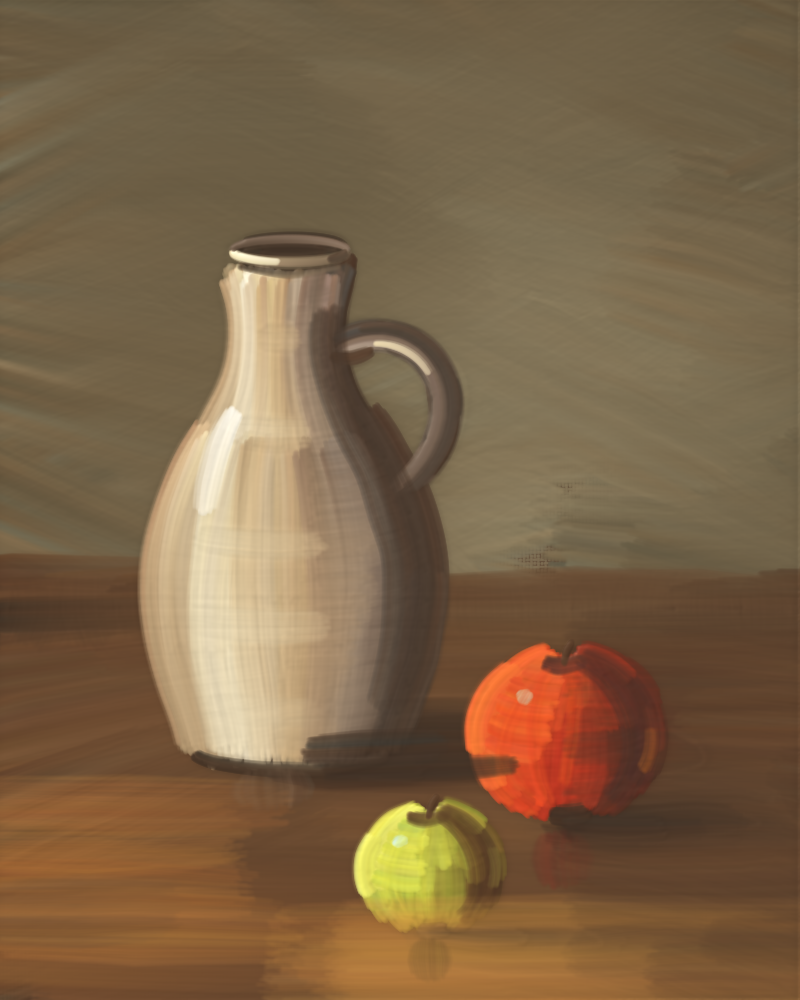
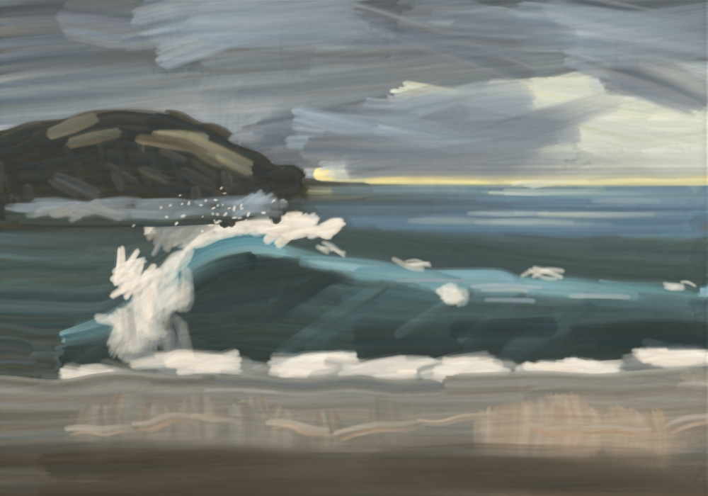
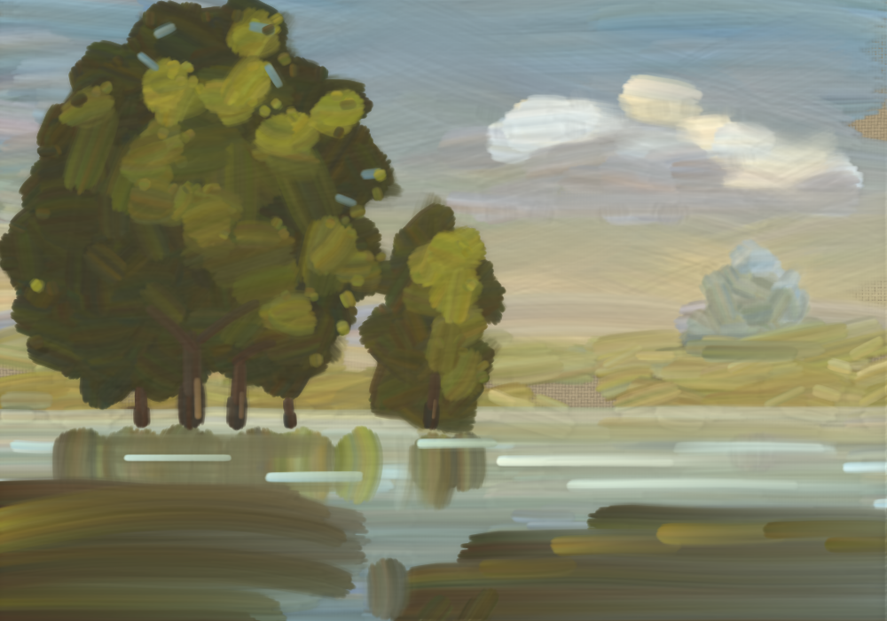

# oil-paint-agents

AI agents painting oil paintings **one brushstroke at a time**, in plain JavaScript.
There are no filters, no source photos, and no pixel reading: the agent decides every stroke's
path, brush, pigment mix, paint load and pressure. A bristle-level oil paint simulator turns
those strokes into paint on linen.

| | | |
|---|---|---|
|  |  |  |
| *Jug and Two Apples*, 826 strokes | *Late Light, Breaking Sea*, 2128 strokes | *Pond Under the Poplars*, 1308 strokes |

Also: [*The Gate Over Guardia Meadow*](examples/gate-over-guardia-meadow/final.png), an impressionist Chrono Trigger homage in 12,308 strokes.

Each example folder has the pass files, the value study, the painter's notes, a 1x render and
a 3x render (`final_3x.jpg`).

## What's here

```
.claude/skills/oil-painting/        a Claude Code skill: copy it into your project or ~/.claude/skills
  SKILL.md                          how to paint with it, and how to run painter agents
  scripts/oilpaint.js               the paint engine (Node and browser)
  scripts/render.js                 render a painting folder to PNG (1x, crops, --scale 3)
  scripts/sketch.js                 render your SVG value study to PNG (needs Playwright)
  scripts/legacy/                   older engine versions, for replaying older stroke logs
  references/PAINTER_GUIDE.md       brush API, pigments, how the paint behaves
  references/STUDIO_METHOD.md       the method: value study, passes, edges, review
  references/LESSONS.md             what made paintings look digital, and what fixed it
  references/PAINTER_PROMPT.md      a prompt template for painter subagents, and critique rounds
examples/                           finished paintings with their pass files, studies and notes
```

## Try it

Requires Node 18+. `sketch.js` also needs Playwright with Chromium (`npm i -g playwright`).

```
node .claude/skills/oil-painting/scripts/render.js examples/jug-and-two-apples --progress
node .claude/skills/oil-painting/scripts/render.js examples/jug-and-two-apples --scale 3
```

The first command writes `final.png`, a PNG per pass in `progress/`, and `strokes.json`, the full
stroke log. The second re-simulates the same strokes on a 3x canvas, giving finer bristles,
weave and grooves.

A pass file is ordinary JavaScript with one object, `p`, in scope:

```js
p.stroke({
  points: [[40, 120], [300, 110], [560, 130]],          // brush path, optional pressure per point
  color: [['ultramarine', 1], ['titanium_white', 4]],   // palette mix (Kubelka-Munk pigments)
  brush: 'flat', size: 70, load: 1,                     // flat | round | filbert | fan | knife
});
p.stroke({ points: [[200, 300], [260, 340]], brush: 'filbert', size: 30, load: 0, color: 'titanium_white' }); // dry blender
p.dry();   // the paint dries: later strokes no longer blend with it
```

## How the engine works

- **Bristles:** each bristle clump carries its own paint, deposits it, runs dry, and picks up
  wet paint from the canvas, so wet-into-wet blending and broken dry-brush edges emerge on
  their own.
- **Mixing:** palette mixes use Kubelka-Munk pigment physics with per-pigment hiding power.
  Each bristle gets a slightly different, imperfectly stirred proportion.
- **Paint shoving:** the brush plows wet paint into ridges at stroke edges, after Baxter et al.,
  *IMPaSTo* (NPAR 2004).
- **Lighting:** the height field (paint thickness, canvas weave and bristle grooves) is lit with
  diffuse shading, cavity darkening and an oil-gloss specular.
- **Replay:** every stroke is seeded from (seed, stroke index), so a painting replays exactly on
  the same engine version.

See [LESSONS.md](.claude/skills/oil-painting/references/LESSONS.md) for what we learned, and
[STUDIO_METHOD.md](.claude/skills/oil-painting/references/STUDIO_METHOD.md) for the painting
method.

## Licence

MIT
